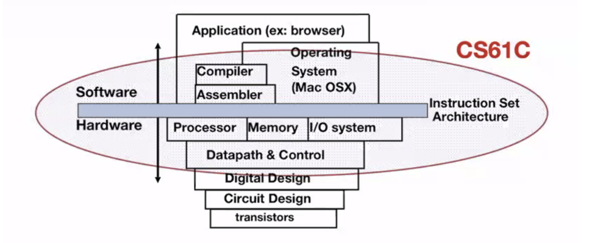

# Intro & Number Representation

## Introduction to Computer Design
### Hardware Design
- RISC-V (Reduced Instruction Set Computers V)
- Open-source hardware alternative to commercial processors
- Assembly language

### Logism
- Alternatives: Verilog or VHDL
- Hardware design schema
- Machine Structures

### Computer Architectures
**Old-School Structures**

**New-School: Parallelization**
- Parallel (software) requests
- Parallel threads
- Assigned to multiple cores
- Parallel Instructions
- Multiple pipelined instructions
- Hardware descriptions
- All gates functioning in parallel

### 5 Great Ideas in Computer Science
**1. Abstraction**
- High Level Language (e.g. C)
- Assembly Language Program (e.g. RISC-V) → Compiler
- Machine Language Program (e.g. RISC-V) → Assembler
- Hardware Architecture Description
- Logic Circuit Description
**2. Moore’s Law**
- The number of transistors on integrated circuits doubles every two years
- Slowing down
- State-of-the-art 5nm transistors (TSMC/Apple)
**3. Principle of Locality/Memory Hierarchy**
- Jim Gray’s Storage Latency Analogy: Access time increases as storage increases
**4. Parallelism**
- Amdahl’s Law
**5. Failures Happen
- There is no perfectly performing hardware
- Dependability via redundancy so that the failing piece does not make the whole system fail
- Redundancy
    - Redundant datacenters
    - Redundant computers
    - Redundant disks (RAID: Redundant Arrays of Independent Disks)
    - Redundant memory bits (ECC: Error Correcting Code)
    - Redundant instructors

## Number Representation
- Everything is a number
- Numbers are usually stored with a fixed size
    - 8-bit bytes, 16-bit half-words, 32-bit words, 64-bit double words, etc.
    - 0 and 1 “bits” (binary digits)
- Arithmetic operations on bits can result in numbers that are either too big or too small (overflow/underflow)

### Why Bits?
- Could be very robustly represented
- Boolean algebra: Logic that only works with two states (true/false)
- Information theory: how to encode data

### Other Bases
- Binary (Base 2), Octal (Base 8), Hexadecimal (Base 16), Decimal (Base 10)
- Value of ith digit is d x basei where i starts at 0 and increases from left to right

### Hexadecimal
- 0, 1, 2, 3, 4, 5, 6, 7, 8, 9, A, B, C, D, E, F
- Bits-to-hex conversion: Group of 4 bits form a hex digit

### Signed and Unsigned Integers
- 2^10 (1024) is approximately 1000

**Unsigned Integers**
- Usually used for memory addresses
- Represent 0 to 2^32 - 1 (32-bit)

**Signed Integers**
- *Two's-Complement* Representation
- Treat 0 as positive
- Represent -2^31 to 2^31 - 1 (32-bit)
- Most-significant bit (MSB) (leftmost) is the sign bit
    - 0 is positive; 1 is negative
- The value of an N-bit word is:
    - -2^(N-1) * b^(N-1) + 2^(N-2) * b^(N-2) + ... + 2^1 * b^1 + 2^0 * b^0
- Methodology
    - Invert all bits and add 1
    - This is the method computer circuits use
- Carry-in and carry-out MSB
    - Carry-in: When MSB is 0, but result MSB is 1, making the number negative
    - Carry-out: When both input MSB is 1, resulting in overflow with the original MSB position being 0, making the number positives