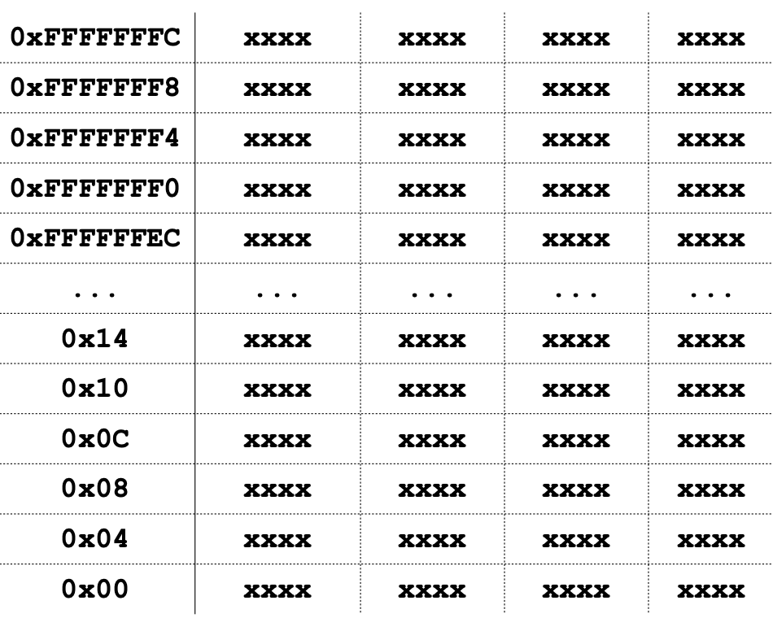

# C Arrays, Pointers, Strings

## C Syntax
### Variable Declaration
Java
- `int x;` // x = 0
- `for (int i = 0; i < ...)`

C
- `int x;` // x = ???
- `for (int i = 0; i < ...)` is not allowed (must define before use)

### Undefined Behavior
- Heisenbugs: Bugs that seem random/hard to reproduce (often happens in C)
- Bohrbugs: Bugs that are deterministic

### Control Flow
- Always use blocks `{}` in conditional statements
```c
if (x == 0)
{
    y++;
}
```
- `while`
    ```c
    while (/* expression (evaluated first) */)
    {
        /* statement */
    }
    
    do
    {
        /* statement (evaluated first) */
    } while (/* expression */)
    ```
- `for`
    ```c
    for (/* initialize */; /* check */; /* update */)
    {
        /* statement */
    }
    ```
- `switch`
    ```c
    switch (/* expression */)
    {
        case const1:    /* statements */
        case const2:    /* statements */
        default:        /* statements */
    }
    ```
    - You need to `break` out of each `case`
- `goto`
    - **DO NOT** use `goto`


### Boolean
- 0 is `false`, **EVERYTHING ELSE** is `true`
- `null` is a special pointer that is also 0, therefore is `false`

### Operators
- Almost same as Java
- Arithmetic: +, -, *, /, %
- Assignment: =
- Augmented assignment: +=, -=, *=, /=, %=, &=, |=, ^=, <<=, >>=
- Bitwise logic: 

### Valgrind
- Turns most unsafe "heisenbugs" to "bohrbugs"

## Memory

- One huge bucket of bits arranged in bytes (8-bits)
- Each byte has an ***address***
    - ex. 32-bit architecture means the # of bits in the address
- Memory could be considered as a huge array of bits
- An ***address*** is a particular memory location
- ***Pointer***: A variable that contains the address of a variable

### Pointer Syntax
- `int *p;`
    - Tells compiler that variable `p` is an address of an `int`
- `p = &y;`
    - Tells compiler to assign address of `y` 
    - `&` in this case is called the *address operator*
- `z = *p;`
    - Tells compiler to assign value at address in `p` to `z`
    - `*` in this case is called the *deference operator*

**Creating a Pointer**
- & operator: get address of a variable
```c
int *p, x;  /* Declare pointer and variable */
x = 3       /* Puts 3 in the address of x */
p = &x;     /* Point p to the address of x */
*p = 5      /* Write to p, which points to x */
```

**Pointers and Paramter Passing**
- Java and C basic parameters "pass by value"
    - Variables are copied into the parameters
- Pointers allow you to "pass by reference"
- To get a function to change the value held in a variable:
    ```c
    void add_one (int *p)
    {
        *p = *p + 1;
    }
    int y = 3;
    add_one(&y); /* y == 4 */
    ```

## Types of Pointer
- Normally a pointer only points to one type (`int`, `char`, `struct`, etc.)
- `void *` is a type that can point to anything
    - Can be converted to anything, but is a source of bugs
    ```c
    void *a = ...;
    int *p = (int *) a;     /* p points to a, but is treated as pointer to an int */
    int **q = (int **) a;   /* q points to a, but is treated as pointer to pointer to an int */
    ```

### Null Pointers
- The pointer of all 0s is special
- The program crashes on write or read to a null pointer
    ```c
    p = null;
    *p = ...; /* This crashes the program! */
    ```

### C Pointer Dangers
```c
void f()
{
    int *ptr;
    *ptr = 5;
}
```
- Never declare variables without initializing
- The above code may or may not crash (heisenbug!)x

### Pointers and Structures
```c
typedef struct {
    int x;
    int y;
} Point;

Point p1;
Point p2;
Point *paddr;
paddr = &p2
```
- Dot notation
    ```c
    int h = p1.x;
    p2.y = p1.y;
    ```
- Arrow notation
    ```c
    int h = paddr->x;
    int h = (*paddr).x;
    ```
- Copying all of p2
    ```c
    p1 = p2;
    p1 = *paddr;
    ```

### Why pointers?
- With a large struct as a paramter, passing by reference is much faster (no additional memory copies)
- Java does this under the hood: Objects in Java are pass-by-reference
- Drawbacks?
    - Pointers are the largest bug source in C
    - Dangling references and memory leaks

### `sizeof()` Operator
- `sizeof(type)` returns number of bytes in object
    - By standard C99 definition, `sizeof(char) == 1`

### Pointer Arithmetic
```c
int *p;
int a;
int b;

p = &a;
p += 1; /* p is now b! This is because the POINTER is incremented here, NOT the VALUE */
```
- **NEVER** code like this!
- This is how arrays work in C!
```c
void inc_ptr(int **h)
{ *h = *h + 1; }

int A[3] = {50, 60, 70};
int* q = A
inc_ptr(&q);
printf("*q = &d\n", *q); /* *q = 60 */
```

### Pointer Conclusion
- All data is in memory
- `*` "follows" a pointer to its value
- `&` gets the address of a value

## Structures
- A `struct` is an instruction to C on how to arrange a bunch of bytes in a bucket
```c
struct foo {
    int a;
    char b;
    struct foo *c;
}
```
- Provides enough space and ***aligns*** the data with padding
    - 4-bytes for `a`
    - 1 byte for `b`
    - 3 unused bytes
    - 4 bytes for `c`
    - `sizeof(struct foo) == 12`

### Unions
- A "union" is also an instruction to C on how to arrange a bunch of bytes
- Always allocates the largest amount of bytes required
```c
union foo {
    int a;
    char b;
    union foo *c;
}
```

## C Arrays
- Declaration: `int ar[2];`
    - You cannot do `int ar[x]`; the number of elements must be *static*
- Array variable is a pointer to the first element
    - `ar[0]` is the same as `*ar`
    - `ar[2]` is the same as `*(ar+2)`
- Can use pointer arithmetic to access arrays
    - `a[i]` is the same as `*(a+i)`
- However, **NEVER** use pointer arithmetic for arrays! (C gives you array operations and use pointer arithmetic under the hood)
- An array does not know its own length (no bound-checking)
    - We must pass the array and its size when we want to manipulate it
    - Out-of-bounds causes Segmentation fault!
- Linked List (extra)
    ```c
    struct LNode {
        void *data;
        struct *LNode *next;
    }
    ```
- Using constants
    ```c
    const int ARRAY_SIZE = 5;
    int i, a[ARRAY_SIZE];
    for (i = 0; i < ARRAY_SIZE; i++) { ... }
    ```
### Array Operations
```c

```

### Array and Structure and Pointers
```c
typedef struct bar {
    char *a;
    char b[18];
} Bar;

...
Bar *b = (Bar*) malloc(sizeof(struct bar));
b->a = malloc(sizeof(char) * 24);
```
- `b->b[5] = 'd'`

### Heartbleed
- In TLS encryption, messages have a length which gets copied into memory before processed
- One message was "echo me back this data," and there is random data just sitting around in the memory which gets echo'ed back, creating a vulnerability

## C Strings
- Just an array of `char`
- `char string[] = "abc";`
- Last character is followed by a 0 byte ("null terminator")
- String length operation **DOES NOT** include the null terminator when getting length!

### `strlen()`
```c
int strlen(char *s)
{
    int i = 0;
    while (s[i]) { i++; }
    return i;
}
```

### Arguments in `main()`
`int main(int argc, char *argv[])`    
- Sometimes it is `char** argv[]`
- `argc` contains the number of strings on the command line
- `argv` is a pointer to an array containing the arguments as strings
- Example:
    - `foo hello 87 "bar baz"`
    - `argc = 4`
    - `argv[0] = "foo"`
    - `argv[1] = "hello"`
    - `argv[2] = "87"`
    - `argv[3] = "bar baz"`

## Endianness
- The network byte order is big-endian, but your computer might be little-endian
- `0x12345678`
    - Big Endian: The first character is the most significant byte (`0x12`)
    - Little Endian: The first character is the least significant byte (`0x78`)