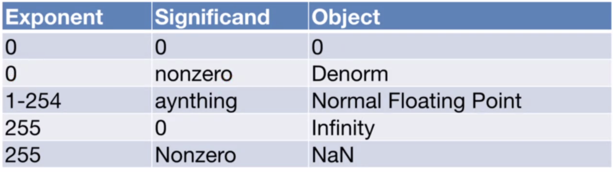

# Floating Pointer Arithmetic

## Table of Contents
  - [Number Representation](#number-representation)
    - [Alternate Representations](#alternate-representations)
  - [Representation of Fractions](#representation-of-fractions)
    - [Fixed-Point Representation](#fixed-point-representation)
    - [Floating-Point Representation](#floating-point-representation)
    - [Double-Precision Standard](#double-precision-standard)
    - [Examples](#examples)
    - [Special Numbers](#special-numbers)
    - [Denormalized Numbers](#denormalized-numbers)
    - [Saving Bits](#saving-bits)
## Number Representation
- A collection of n bits can represent one of any 2^n things
- Unsigned: 0 to 2^n - 1
- Signed: -2^(n-1) to 2^(n-1) - 1
- Addition and subtraction is easy for signed and unsigned integers
- Multiply by 2^n by left-shift (<<) by n
- Divide by 2^n
  - Right-shift (>>) by n
  - For unsigned (logical) shift: Left gets 0s
  - For signed (arithmetic) shift: Left gets the sign bit

### Alternate Representations
**Sign/Magnitude**
- Let the first bit be the sign bit
- Allow representation of 2^(n-1) - 1 numbers (-2^(n-1) + 1 to 2^(n-1) - 1)
- Gives us two zeroes

**Biased**
- The actual value is the binary value plus a fixed bias
- Can set our range to be arbitrary
- No discontinuity around 0
- e.g. bias = -127
  - 00000000 = -127
  - 11111111 = +128
- Disadvantages
  - All bits 0 != 0
  - A + B = A + B - bias (additional step)

**Other Numbers**
- Fractions
- Very large numbers
- Very small numbers
- How to trade off precision for range?

## Representation of Fractions
### Fixed-Point Representation
- Decimal "point" signifies boundary between integer and fractional parts
- e.g. 25.2406 = 25 (.) 2406 = 2\*10^1 + 5\*10^0 + 2\*10^-1 + 4\*10^-2 + 0\*10^-3 + 6\*10^-4
- 10.1010`_two` = 2.625`_ten`
- Range of 6-bit representations: 0 to 3.9375

### Floating-Point Representation
- Scientific notation in decimal: 10e5
- 3-digit mantissa + 2-digit exponent
- `float` is floating-point and `double` is double-precision floating-point
- IEEE 754 Floating-Point Standard
- Sign: 1-bit, Exponent: 8-bit, Significand (Matissa): 23-bits
- Biased exponent: Allows unsigned comparison between exponents
  - Bigger is always larger

### Double-Precision Standard
- 64 bits
- 11 bits for exponent
- 52 bits for fraction
- 2\*10^-308 to 2\*10^308
- 53-bits of precision

### Examples
- 1 1000 0000 1000 0000 0000 0000 0000 0000
- (1) (1000 0000) (1000 0000 0000 0000 0000 0000)
- -1 * 2^(128 - 127) * 1.1_2
- -1.5 * 2
- -3
- Infinity: Sign bit 0 or 1, largest exponent (all 1s), 0 in fraction
- NaN: Sign bit 0 or 1, largest exponent (all 1s), not zero in fraction

### Special Numbers

### Denormalized Numbers
- Exponent = 0, significant non-zero
- No implied leading 1 (implicit exponent = -126)

### Saving Bits
- IEEE Half-precision uses 16-bit
  - 1 sign bit
  - 5 exponent bits
  - 10 significant bits
- Applications in machine learning, graphics and signal processing due to the lack of required precision