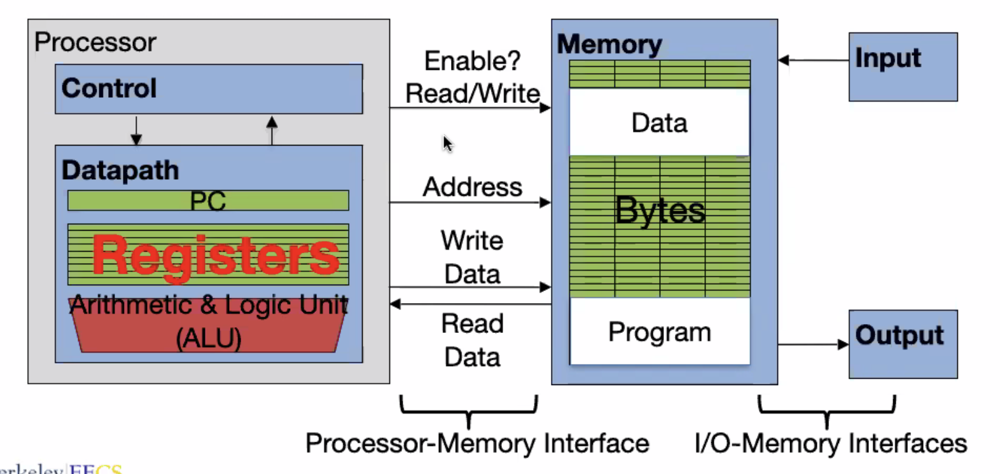
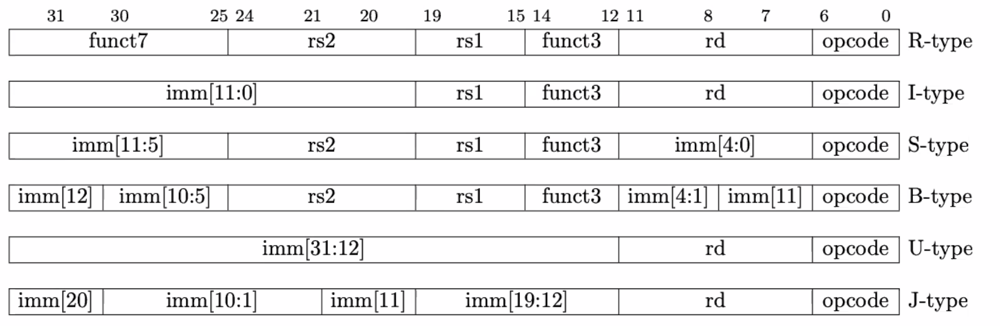

# Assembly, RISC-V Intro

## Assembly Language

### Instruction Set Architecture (ISA)
- Job of the CPU is to execute instructions
- Instructions are executed in sequence
  - Advanced processors can execute in parallel
- CPU belong to families, each with their own ISA
  - Examples of ISA: ARM, Intel x86, MIPS, RISC-V, x86_64
  - These are still *abstractions*. Could be different hardware, but same instruction set
- Early trend was to add more and more complex instruction to new CPU's: Complex Instruction Set Computer (CISC)
  - e.g. VAX architecture that could evaluate polynomials
- Reduced Instruction Set Computer (RISC)
  - Keep instruction set small and simple; easier to build fast hardware
  - Abstract away complicated operations to software

### Architectures
- Servers: x86/64
  - Software: Windows/Linux
- Phones/embedded: ARM
  - Software: Linux/Android
  - Efficient for small chips, small hardware (e.g. doorbells)
- Each assembly language is tied to a particular ISA


## RISC-V Architecture
- Comes in 32-bit, 64-bit and 128-bit
- Textbook uses 64-bit
- We use 32-bit
- Efficient concurrent operations

## Registers vs. Variables

### Registers
- Assembly does not have variables
- Registers: Assembly language operands
  - Limited number of places to hold values built directly into the hardware
  - Arithmetic operations can only be performed on registers
- Registers are directly in hardware; fast to access



- Registers are 100-500 times faster than DRAM (Dynamic Random Access Memory)
- There are 32 registers/words (4-bytes each) in RISC-V
  - 128 bytes in total
- x0 is special: always hold zero value; so there is really only 31 available registers

### Memory Alignment
- Memory operations address 32-bit words
- Word-aligned: Integers start on even 4-byte boundaries (address is even multiple of 4; last 2 bits of address is 00)
  - e.g. `0xa04` -> `0xa08` -> `0xa0c` -> ...
- RISC-V does not require integers be word-aligned, but ***in practice***, it is required

## RISC-V Instructions
- Instructions are fixed, 32 bytes long word-aligned
- Each instruction uses predefined formats



### Syntax
- Instructions have opcode and operands
  - e.g. `add x1, x2, x3 # x1 = x2 + x3`
  - Opcode: `add`
  - Operands: `x1, x2, x3`
- `#` is assembly comment (`# comment`)

### Addition and Subtraction (`add`, `sub`)
- Addition: `add x1, x2, x3`
  - x1 = x2 + x3
- Subtraction: `sub x3, x4, x5`
  - x3 = x4 - x5


Example: `a = b + c + d - e;`
```
add x1, x2, x3 # temp (x1) = b + c
add x1, x1, x4 # temp = temp + d
add x1, x1, x5 # a = temp - e
```

### Register x0
- Move a value from one register to another
  - `add x3, x4, x0`: Moves `x4` to `x3`
- Throw away a value

### Immediates (`addi`)
- Immediates are used to provide numerical constants
- e.g.: `addi x3, x4, -10`
  - x3 = x4 - 10
- Moving with `addi`: `addi x3, x4, 0`
- "Sign-extended"
  - Bits 31:12 gets the same value as bit 11, which indicates the sign

## Memory
- "Load" and "store" instructions are used to access data from the memory (which is slower)
- Data typically smaller than 32 bits, but rarely smaller than 8 bits
- Word size is 4 bytes
- Memory is addressable to individual bytes
- Word addresses are 4 bytes apart

### Transfer from Memory to Register
```c
int A[100];
g = h + A[3];
```
- Assume `x13` holds the base register pointing to `A[0]`, `x12` holds `h`
- 12 is offset in bytes (3 * 4)
- Use load word (`lw`) in RISC-V:
  ```
  lw    x10, 12(x13)    # register x10 gets A[3], which is 12 + base address (x13)
  add   x11, x12, x10   # g = h + A[3]
  ```

```c
int A[100];
A[10] = h + A[3];
```
- Assume `x13` holds base register, `x12` holds `h`
- A[3] is at offset 12, A[10] is at offset 40 (4 * 10)
- Using store word (`sw`) in RISC-V:
    ```
    lw  x10, 12(x13)    # temp reg x10 gets A[3]
    add x10, x12, x10   # temp reg x10 gets h + A[3]
    sw  x10, 40(x13)    # A[10] = h + A[3]
    ```

### Loading and Storing Bytes
- Load byte: `lb`
- Store byte: `sb`
- e.g. `lb x10, 3(x11)`
  - Memory location with address = 3 + `x11` is copied to the low byte position of register `x10`
- `lbu` is used to load and zero extend to fill register for unsigned byte
- There is no `sbu`

