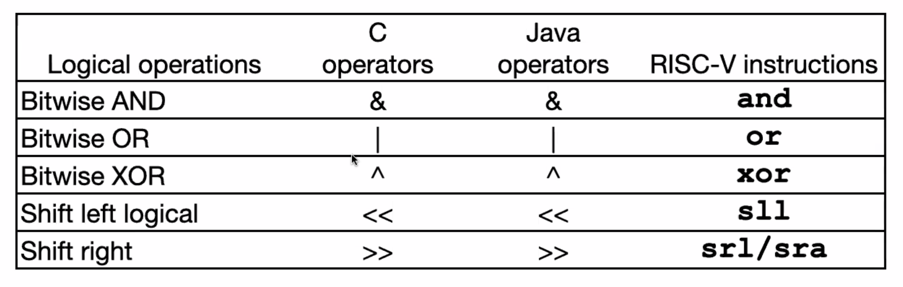

# RISC-V, RISC-V Functions

## Storing the Program
- Each instruction is 32-bits (exactly one word)

### Assembler to Machine Code


## Logical Instructions


### Logical Shift Left `slli`
```
slli x11, x12, 2 # x11 = x12 << 2
```
- Multiplication by 2^n

### Logical Shift Right `srai`
```
srai x11, x12, 2 # x11 = x12 >> 2
```
- Similar but not exactly dividing by 2^n

## Control Flow Instructions

### Conditional Statements - Branches
- Branch if Equal: `beq <register1> <register2> L1`
- "Go to instruction labeled L1 if (value in register1) == (value in register2)"
- Branch If Not Equal: `bne`
- Branch If Less Than: `blt`
- Branch If Greater Than or Equal: `bge`

### Labels in Assembly Language
- `foo: add x2 x1 x0`
- The assembly converts `foo` to addresses
- Using labels: `bne x0 x2 foo`

### Examples
- `f -> x10`
- `g -> x11`
- `h -> x12`
- `i -> x13`
- `j -> x14`

**If**
```C
if (i == j)
    f = g + h;
```

```
bne x13 x14 done
add x10 x11 x12
done:
```

**If-else**
```c
if (i == j)
    f = g + h;
else
    f = g - h;
```
```
bne x12 x14 else
add x10 x11 x12
j done # jump
else: sub x10 x11 x12
done
```

### Magnitude Comparisons
- `blt reg1, reg2, label`
- `if (reg1 < reg2) goto label;`
- `bgt` and `blt` can be used, but are not actual machine instructions

## Loops
Example:
```c
int A[20];                          // x8 holds pointer to A
int sum = 0;                        // x10 = sum, x11 = i
for (int i = 0; i < 20; i++)
    sum += A[i];
```

```
add x10, x0, x0         # sum = 0
add x11, x0, x0         # i = 0
addi x12, x0, 20        # x12 = 20
loop:
bge x11, x12, exit
sll x13, x11, 2         # i * 4
add x13, x13, x8        # A + i
lw x13, 0(x13)          # *(A + i)
add x10, x10, x13       # increment sum
addi x11, x11, 1        # i++
j loop                  # iterate
exit:
```

Optimized:
```
add x10, x0, x0         # sum = 0
add x11, x0, x8         # copy of A
addi x12, x8, 80        # x12 = 80 + A
loop:
lw x13, 0(x11)
add x10, x10, x13
addi x11, x11, 4
blt x11, x12, loop
```

### Unconditional Branches: Jump and Link
- `jal rd offset`
- `jalr rd rs (offset)`
- `jalr` uses jumps to register `rs` (with offset if provided)
1. Add the offset to the current address in the program counter (PC)
2. Store into rd the value of PC + 4

**Uses**
- `jal` is used to calling functions
- `jalr` is used to return from functions